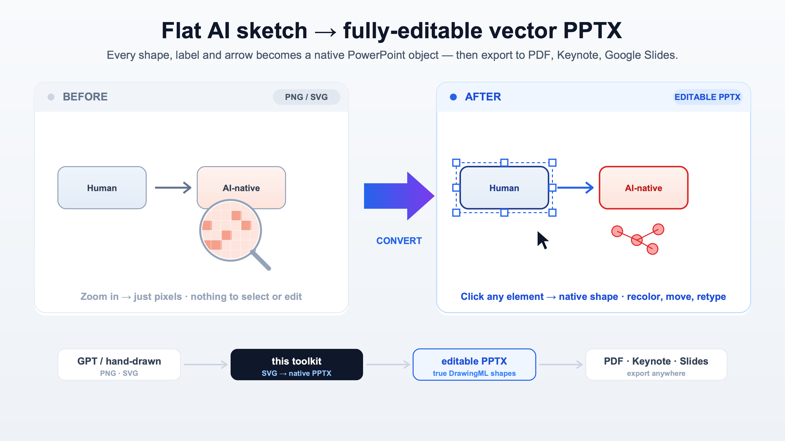

<div align="center">

# svg2pptx-skill

**English** · [简体中文](./README_zh.md)

### Turn a flat AI sketch into a **fully-editable vector PowerPoint** — in one command.

*Every shape, label, arrow and gradient becomes a real PowerPoint object you can click, recolor and retype — then export to PDF, Keynote or Google Slides.*



</div>

---

## Why this exists

AI is great at *drawing* a diagram and terrible at handing you something you can *edit*. Ask GPT or
Claude for a mechanism figure, an architecture, a flowchart — you get a **PNG or an SVG**. Drop that
into PowerPoint and it's a dead rectangle of pixels: you can't nudge a box, fix a typo, recolor an
arrow, or match your brand. So you redraw it by hand. Again.

**svg2pptx-skill closes the last mile.** It rebuilds your SVG as **native DrawingML** — the same
shape language PowerPoint uses internally — so the deck opens as a pile of *individually editable*
objects, not a screenshot.

```
   GPT / Claude / hand-drawn          this skill              you, in PowerPoint
   ┌──────────────────────┐      ┌───────────────┐      ┌──────────────────────────┐
   │  draft  PNG  ·  SVG   │ ───▶ │ SVG → native  │ ───▶ │ edit every shape & label │ ──▶ PDF · Keynote · Slides
   └──────────────────────┘      │     PPTX       │      └──────────────────────────┘
                                  └───────────────┘
```

> **The workflow it unlocks:** *prompt an AI for the diagram → convert here → polish in PowerPoint →
> export to PDF.* You get AI's speed on the first draft and full human control on the finish — and a
> source file you actually own.

---

## What "native" means (and why it matters)

| | Picture-in-a-slide (the usual AI export) | **svg2pptx-skill** |
|---|---|---|
| Move / resize one box | ❌ it's baked into the image | ✅ it's a real shape |
| Recolor an arrow | ❌ | ✅ |
| Fix a typo | ❌ re-generate the whole thing | ✅ click and type |
| Match brand colors / fonts | ❌ | ✅ |
| Export to crisp PDF at any size | blurry (raster) | ✅ vector-sharp |

Shapes → `custGeom`/`prstGeom`, text → editable text frames, gradients → `gradFill`, arrows →
native arrowheads, dashes/rotation/patterns → their DrawingML equivalents.

---

## Quick start

```bash
git clone https://github.com/JamieJustTang/svg2pptx-skill.git
cd svg2pptx-skill
python3 -m venv .venv && source .venv/bin/activate
pip install -r requirements.txt

# one command — output lands next to your file
python3 convert.py path/to/diagram.svg
```

```bash
python3 convert.py diagram.svg -o out.pptx     # custom output path
python3 convert.py slides/ -o deck.pptx         # a folder of .svg -> one multi-page deck
python3 convert.py diagram.svg --check-only      # just run the compatibility gate
python3 convert.py diagram.svg --svg-snapshot    # also emit a pixel-faithful *_svg.pptx
```

Try it on the bundled examples:

```bash
python3 convert.py examples/support_structure_demo.svg
python3 convert.py examples/filtration_demo.svg
```

See [`examples/`](examples/) for the source SVGs paired with their converted `.pptx`.

---

## Only have a PNG? One prompt turns it into a clean SVG first

This skill converts **SVG**, not pixels. If your figure is a **PNG/JPG** (a screenshot, or an AI
draft), have a strong vision model **redraw it as a spec-compliant SVG**, then `convert.py` it. This
beats auto-tracing — you get editable *text* and clean shapes, not uneditable outlines.

**Recommended models:** GPT-5.5 Pro, Claude Opus 4.6+ (4.8 latest), or any current SOTA model.

1. Open a chat with a recommended model and **attach your PNG**.
2. Paste the prompt below. → 3. Save the output as `figure.svg`. → 4. `python3 convert.py figure.svg`.
5. If the quality gate errors, paste it back and ask the model to fix — repeat until clean.

<details>
<summary><b>📋 Click to copy the ready-to-use prompt</b> (canonical copy: <a href="references/png-to-svg-prompt.md"><code>references/png-to-svg-prompt.md</code></a>)</summary>

```
You are an expert technical illustrator and SVG engineer. I am attaching a raster image (PNG/JPG)
of a diagram — a scientific figure, mechanism, architecture, flowchart, or chart. Redraw it as ONE
clean, fully EDITABLE SVG that faithfully reproduces the original AND converts losslessly into native
PowerPoint shapes (DrawingML).

## Fidelity — match the original
- Reproduce the layout, relative positions, sizes, and colors (sample the exact HEX values).
- Reproduce EVERY text label verbatim, in its original language — do not translate, summarize, or
  invent text. Keep all text as real <text> elements (editable), never as outlines or images.
- Redraw every visual as a vector primitive (rect, circle, ellipse, line, path, polygon) — do NOT
  embed the bitmap.
- Preserve arrow directions and relationship semantics (activation / flow vs. inhibition).

## Canvas
- Set <svg> width, height, and viewBox to the image's pixel dimensions; width and height MUST equal
  the viewBox (e.g. width="1280" height="720" viewBox="0 0 1280 720").
- Add a background <rect> for the page color. Work in pixels only (never pt).

## Hard rules — PowerPoint/DrawingML compatibility (do NOT violate any)
- Inline attributes ONLY. No <style>, no class, no CSS, no @font-face.
- BANNED elements/attrs: mask, <foreignObject>, <symbol>+<use>, textPath, <animate>/<set>, <script>,
  <iframe>, group opacity (<g opacity>), image opacity, and rgba()/hsla() colors.
- Colors: HEX only. Transparency via fill-opacity / stroke-opacity.
- Characters: write typography & symbols as RAW Unicode (— – → ± × ÷ ≤ ≥ ≈ ° α β γ · …). Escape ONLY
  the XML reserved characters as entities: & < > " '  →  &amp; &lt; &gt; &quot; &apos;. NEVER use HTML
  named entities (&nbsp; &mdash; &rarr; &alpha; …) — they abort the conversion.
- Text: one logical line = ONE <text> element; use inline <tspan> only for color/weight/size runs on
  that same line. Inline <tspan> must NOT carry x, y, or dy (those start a new line and split the
  frame) — use dx only for kerning. For separate lines or columns, use separate <text> elements (or
  an outer line-break <tspan x=".." dy="..">).
- Fonts: every font-family stack must END with a pre-installed family (Arial, Helvetica, Calibri,
  Times New Roman, Microsoft YaHei, SimSun, or Consolas).
- Arrows: use marker-start / marker-end ONLY with a <marker> defined in <defs>, with orient="auto",
  a triangle / diamond / circle (closed) shape, and the marker's fill EQUAL to the line's stroke
  color. Never reference a marker id you did not define. For inhibition (⊥ / T-bar), draw an explicit
  short perpendicular <line>, not a marker.
- clip-path is allowed ONLY on <image> (with a single shape child in its <clipPath>). For non-image
  shapes, draw the target geometry directly — do not clip.
- Group related elements in <g id="..."> with descriptive ids (each becomes a PowerPoint group).
- Effects that are fine: linearGradient/radialGradient in <defs> (fill="url(#id)"),
  stroke-dasharray, transform="rotate(angle, cx, cy)". For donut/pie sectors, compute arc endpoints
  with trigonometry (x=cx+r·cosθ, y=cy+r·sinθ; start at -90°; large-arc flag = 1 when the sector > 180°).

## Self-check before you answer
Confirm: width/height == viewBox; NO banned features; NO HTML named entities; NO x/y/dy on inline
<tspan>; every referenced marker is defined with a matching color; all text is present and verbatim.

## Output
Output ONLY the SVG code, starting with <svg ...> and ending with </svg>. No prose, no markdown fences.
```

</details>

---

## Install as a Claude Code plugin (one click)

This repo is also a Claude Code **plugin marketplace**. Inside Claude Code:

```text
/plugin marketplace add JamieJustTang/svg2pptx-skill
/plugin install svg2pptx@svg2pptx
```

The skill becomes available immediately. After install, run the dependency step once
(`pip install -r requirements.txt`) in the cached plugin directory so the Python engine can run.

## Using it as an AI-agent skill

This repo is structured as a **skill**: [`SKILL.md`](SKILL.md) is the agent entry point. Point an
agent (Claude Code, Cursor, Codex, …) at this folder and it can drive the whole flow — author a
compatible SVG, run the quality gate, fix what the gate flags, and export — without you touching the
CLI. The companion contract [`references/shared-standards.md`](references/shared-standards.md) tells
the model exactly which SVG features survive the trip to PowerPoint.

A natural agent loop:
> *"Draw an X as an SVG following `references/shared-standards.md`, then run `convert.py` and fix any
> gate errors until it exports clean."*

---

## How it works

```
your SVG ─▶ svg_quality_checker ─▶ finalize_svg ─▶ svg_to_pptx ─▶ native .pptx
            (compatibility gate)    (embed icons,    (per-element
             0 errors required       crop/embed       DrawingML
             before continuing)      images, flatten   conversion)
                                     text, roundRect)
```

- **Quality gate** — catches SVG features PowerPoint can't represent *before* export, with a precise
  message instead of a silently broken slide. There's no auto-fix: an error means re-author the
  element so the substitute keeps your intent. See [`references/shared-standards.md`](references/shared-standards.md).
- **Authoring rule of thumb** — inline styles only; raw Unicode for symbols; one logical text line =
  one `<text>`; use `marker-end` for arrows, `clip-path` on `<image>` for crops, gradients/patterns
  for fills. Full contract in the reference.
- **Bonus** — [`scripts/svg_position_calculator.py`](scripts/svg_position_calculator.py) calibrates
  data-chart geometry (bar heights, pie/donut angles, scatter points) when values must map to pixels.

---

## Requirements

- Python 3.10+
- `pip install -r requirements.txt` (`python-pptx`, `Pillow`, `lxml`, `svglib`, `reportlab`, `numpy`)
- *Optional:* `cairosvg` (preferred legacy-Office PNG fallback; needs system `cairo` —
  `brew install cairo`). Without it, `svglib`+`reportlab` handle the fallback.
- Output opens in PowerPoint 2016+ (native SVG-aware Office shows editable shapes; older Office falls
  back to an embedded PNG automatically).

---

## Credits & license

The SVG → DrawingML engine is extracted and adapted from
**[hugohe3/ppt-master](https://github.com/hugohe3/ppt-master)** (MIT) — full credit to the original
author for the conversion core. This repository repackages the SVG→PPTX path as a standalone,
agent-friendly skill.

Released under the [MIT License](LICENSE). Bundled icon sets:
[Heroicons](https://github.com/tailwindlabs/heroicons) (MIT) and
[Lucide](https://github.com/lucide-icons/lucide) (ISC).
